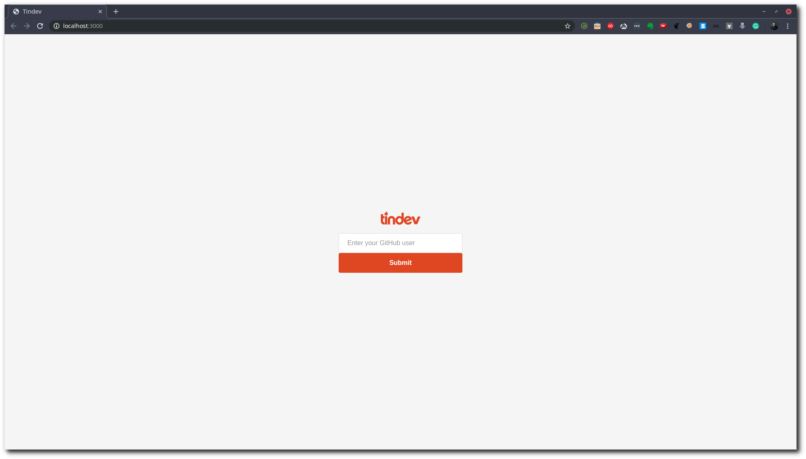

# TinDev

An app like tinder for devs :)

Developed with Node Js, React and React Native

## Usage

First is necessary to generate one .env with MongoDB URI, in the case I use [MongoDB Atlas](https://www.mongodb.com/cloud/atlas) (See [.env_example](./.env_example))

	

<h6 align="center">
	<a href="https://raw.githubusercontent.com/mswell/dotfiles/master/LICENSE">MIT</a>
	©
	Wellington Moraes
</h6>